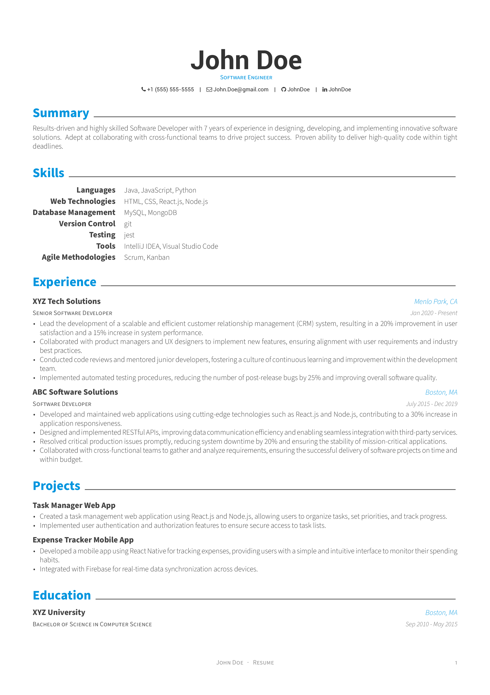

# Awesome CV Resume

## Overview
Latex source code for my resume, largely sourced from [junhaodong's resume](https://github.com/junhaodong/resume) which is a fork of [awesome-cv](https://github.com/posquit0/Awesome-CV/tree/master). Updated to be able to compile with Tex Live 2023 (miktex running into some missing font awesome issues). 

## Sample Compiled Resume

  

Feel free to also download the pdf for the full functionality (working social links).

## Quick Start
As pointed out by the project this is forked from: 
> Feel free to modify my `.tex` file to create your own resume! Please don't use my resume for anything else without permission though.
